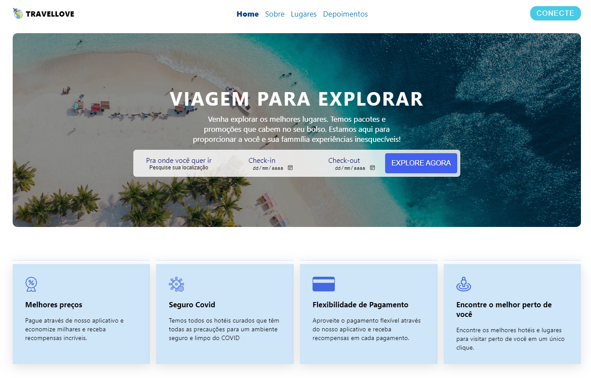
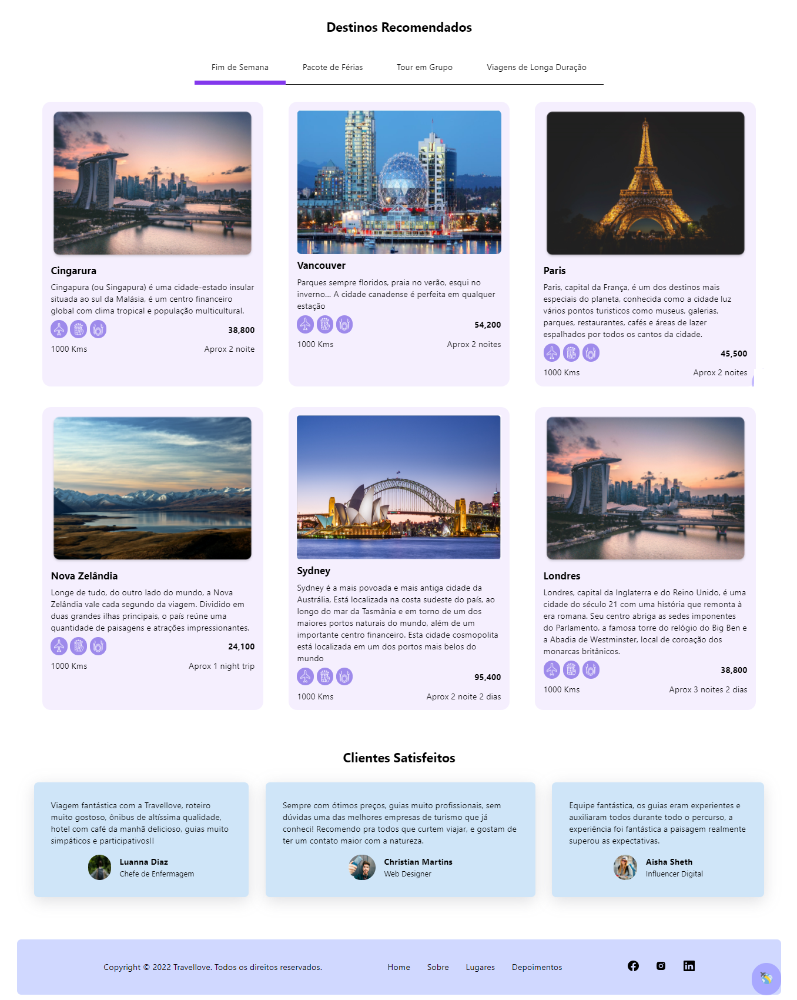
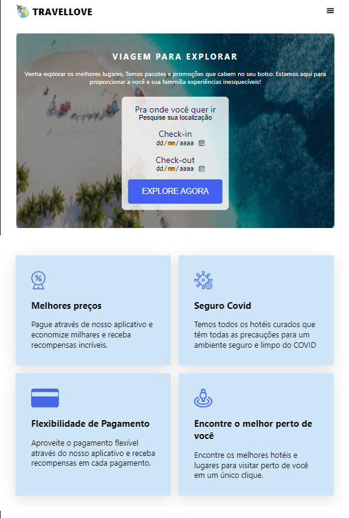
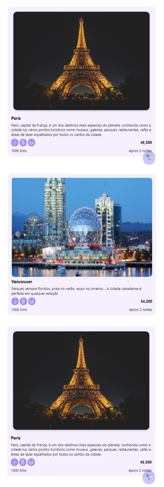
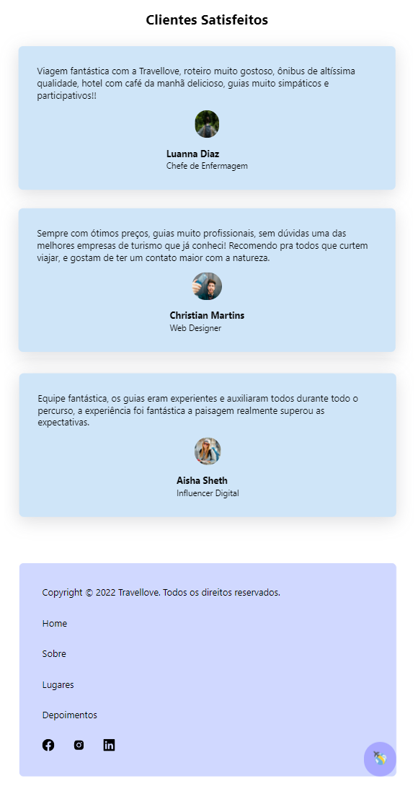
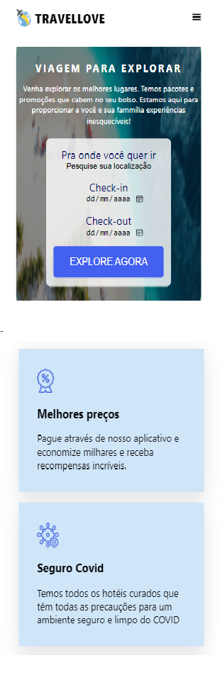
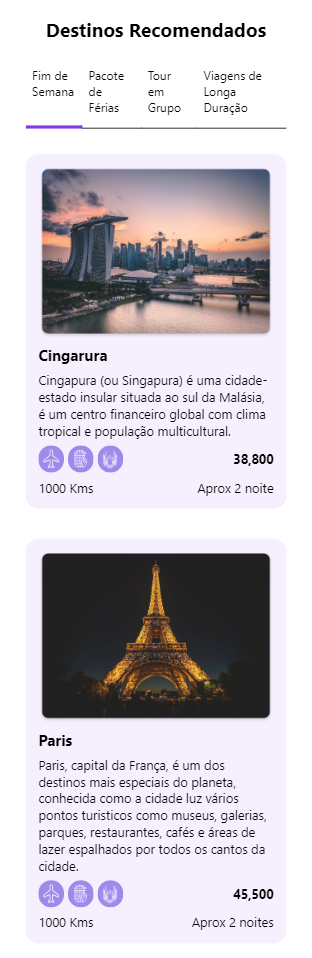
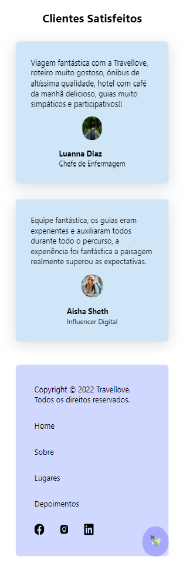

<h1 align="center">
     
    
🚀 Travellove

</h1>

 

 <strong>Trevellove</strong> é uma agência de viagem focada na sua expeciência e satisfação. Venha explorar os melhores lugares. Temos pacotes e promoções que cabem no seu bolso. Estamos aqui para proporcionar a você e sua família experiências inesquecíveis!

 

<h1>
     
    
🧠 Contexto

</h1>

Travellove é uma página simples desenvolvida em react para testa meu aprendizado.

- Link do Surge
- Layout (Desktop / Tablet / Mobile)
- Tecnologias Utilizadas
- Saudações da Eli!

 

<h1>
     
    
🔗 Link do projeto no Surge

</h1>

https://worthless-quarter.surge.sh/

 

<h1>
     
    
🎨 Layout

</h1>

## Web

     

     

## 

## Tablet

     

      

      

## Mobile

     
     
     
  

---

<h1>
     
    
🛠️ Tecnologias Utilizadas

</h1>

 
 
 
  
  
  
  
 

 

<h1>
     
    
👋 Saudações, Eli!

</h1>

_Caso queira contribuir com meu projeto, será totalmente bem-vindx!!!_
_Qualquer dúvida ou sugestão, chama no contatinho!_

 

### Vamos nos conectar!

- [LinkedIn](https://www.linkedin.com/in/elisabete-a-santos/)
- [GitHub](https://github.com/elisabetealves)

 

### Feito com 💕 e muita dedicação
